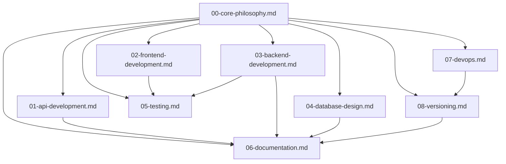

# Agent Rules - Specialized Claude Agents

This directory contains specialized rulesets for different types of Claude agents. Each ruleset focuses on specific domains and provides clear, actionable guidelines.

## Why Specialized Agents?

Instead of a single large ruleset, we've broken down `CLAUDE.md` into specialized agent rules:

- **Faster context loading** - Agents only load relevant rules
- **Clearer responsibilities** - Each agent knows its domain
- **Easier maintenance** - Update specific domains without touching others
- **Better performance** - Less context = faster responses

---

## Agent Rulesets

### 00. Core Philosophy
**File:** `00-core-philosophy.md`
**Applies to:** ALL agents (universal)
**Topics:** KISS, YAGNI, Design Principles, Cross-Platform Mandate, Code Quality

**Use when:** Starting any development task

---

### 01. API Development
**File:** `01-api-development.md`
**Specialization:** RESTful API design, endpoint implementation, versioning
**Topics:** API standards, HTTP methods, status codes, authentication, pagination

**Use when:**
- Creating or modifying API endpoints
- Designing API architecture
- Implementing RESTful services
- Documenting APIs

---

### 02. Frontend Development
**File:** `02-frontend-development.md`
**Specialization:** React, TypeScript, styled-components, CORS
**Topics:** Component design, DOM props, React Router, state management, CORS configuration

**Use when:**
- Building UI components
- Working with React/TypeScript
- Implementing styled-components
- Configuring frontend-backend communication
- Fixing CORS issues

---

### 03. Backend Development
**File:** `03-backend-development.md`
**Specialization:** Python/FastAPI, Node.js, security, imports
**Topics:** Python imports, FastAPI patterns, security standards, Pydantic models

**Use when:**
- Building backend APIs
- Implementing business logic
- Working with Python imports
- Implementing security measures
- Using FastAPI or Express

---

### 04. Database Design
**File:** `04-database-design.md`
**Specialization:** MongoDB, MySQL, schema design, indexing
**Topics:** Naming conventions, schema design, indexing, query optimization

**Use when:**
- Designing database schemas
- Creating collections or tables
- Writing database queries
- Optimizing database performance
- Managing data consistency

---

### 05. Testing
**File:** `05-testing.md`
**Specialization:** Unit testing, integration testing, performance testing
**Topics:** Test strategies, performance benchmarks, load testing, test coverage

**Use when:**
- Writing unit tests
- Implementing integration tests
- Running performance tests
- Load testing APIs
- Measuring test coverage

---

### 06. Documentation
**File:** `06-documentation.md`
**Specialization:** Technical docs, API docs, user guides, README
**Topics:** Documentation structure, docstrings, API documentation, README standards

**Use when:**
- Writing documentation
- Creating API documentation
- Updating README files
- Writing code comments
- Maintaining CHANGELOG

---

### 07. DevOps
**File:** `07-devops.md`
**Specialization:** Docker, CI/CD, deployment, cross-platform
**Topics:** Docker standards, cross-platform scripts, deployment procedures, monitoring

**Use when:**
- Working with Docker
- Setting up CI/CD
- Deploying applications
- Writing cross-platform scripts
- Configuring infrastructure

---

### 08. Versioning
**File:** `08-versioning.md`
**Specialization:** Semantic versioning, releases, changelog, git tagging
**Topics:** SemVer, release checklists, git tagging, deprecation policy

**Use when:**
- Releasing new versions
- Creating git tags
- Writing CHANGELOG entries
- Managing deprecations
- Planning breaking changes

---

## How to Use These Rules

### For Agents

When assigned a task, load the relevant rulesets:

1. **Always load:** `00-core-philosophy.md` (universal rules)
2. **Load based on task:**
   - API work → `01-api-development.md`
   - Frontend work → `02-frontend-development.md`
   - Backend work → `03-backend-development.md`
   - Database work → `04-database-design.md`
   - Testing → `05-testing.md`
   - Documentation → `06-documentation.md`
   - DevOps → `07-devops.md`
   - Versioning → `08-versioning.md`

### For Developers

When creating new agent tasks:

1. Identify the domain (API, Frontend, Backend, etc.)
2. Reference the appropriate ruleset
3. Follow the guidelines strictly
4. Update the ruleset if you discover new patterns

---

## Quick Reference Matrix

| Task | Primary Ruleset | Secondary Rulesets |
|------|----------------|-------------------|
| Create API endpoint | `01-api-development.md` | `03-backend-development.md`, `06-documentation.md` |
| Build React component | `02-frontend-development.md` | `05-testing.md` |
| Design database schema | `04-database-design.md` | `06-documentation.md` |
| Write unit tests | `05-testing.md` | `03-backend-development.md` OR `02-frontend-development.md` |
| Deploy application | `07-devops.md` | `08-versioning.md` |
| Release new version | `08-versioning.md` | `06-documentation.md`, `07-devops.md` |
| Fix security issue | `03-backend-development.md` | `05-testing.md`, `08-versioning.md` |
| Optimize performance | `05-testing.md` | `04-database-design.md` |

---

## Ruleset Dependencies



**Core Philosophy (00)** is the foundation that all other rulesets build upon.

---

## Maintenance

### Updating Rulesets

When updating rules:

1. Update the specific ruleset file
2. Check for dependencies (see diagram above)
3. Update the main `CLAUDE.md` if changes are universal
4. Update this README if structure changes

### Adding New Rulesets

To add a new specialized ruleset:

1. Create `0X-{domain}.md` (use next number)
2. Follow the template format:
   ```markdown
   # {Domain} Agent Rules

   **Specialization:** Brief description
   **Prerequisites:** Must follow `00-core-philosophy.md`

   ---

   ## Section 1
   Content...

   ## Section 2
   Content...
   ```
3. Update this README with the new ruleset
4. Update the Quick Reference Matrix
5. Update the Dependency diagram

---

## Relationship with Main CLAUDE.md

- **`CLAUDE.md`**: Master file with ALL rules (comprehensive)
- **Agent Rules**: Extracted specialized subsets (focused)

**When to update:**
- Update `CLAUDE.md` → Extract to agent rules
- Update agent rules → Sync back to `CLAUDE.md`
- Keep both in sync for consistency

---

## Examples

### Example 1: Creating a New API Endpoint

**Agent loads:**
1. `00-core-philosophy.md` - Core principles
2. `01-api-development.md` - API standards
3. `03-backend-development.md` - Backend implementation
4. `06-documentation.md` - API documentation

**Agent follows:**
- RESTful design principles
- HTTP status code standards
- Pydantic validation
- Security guidelines
- Documentation requirements

### Example 2: Building a React Component

**Agent loads:**
1. `00-core-philosophy.md` - Core principles
2. `02-frontend-development.md` - React standards
3. `05-testing.md` - Testing guidelines

**Agent follows:**
- Transient props pattern
- TypeScript conventions
- Component testing standards
- Performance optimization

### Example 3: Releasing a New Version

**Agent loads:**
1. `00-core-philosophy.md` - Core principles
2. `08-versioning.md` - Version management
3. `06-documentation.md` - Changelog format
4. `07-devops.md` - Deployment procedures

**Agent follows:**
- Semantic versioning rules
- Release checklist
- Git tagging standards
- Documentation updates

---

## Benefits

### For Development

- ✅ **Consistency**: All agents follow same standards
- ✅ **Efficiency**: Faster context loading
- ✅ **Quality**: Domain expertise in each ruleset
- ✅ **Maintainability**: Easy to update specific domains

### For AI Agents

- ✅ **Focused context**: Only load relevant rules
- ✅ **Clear responsibilities**: Know what to do
- ✅ **Better performance**: Less context = faster responses
- ✅ **Scalability**: Easy to add new domains

---

## Contributing

When adding new patterns or guidelines:

1. Determine which ruleset it belongs to
2. Update the appropriate ruleset file
3. Keep guidelines clear and actionable
4. Provide examples where helpful
5. Update this README if adding new domains

---

## Questions?

For questions or clarifications:
- Check the main `CLAUDE.md` for comprehensive rules
- Review the appropriate specialized ruleset
- Consult the Quick Reference Matrix above
- Ask the user for clarification if still unclear

---

**Last Updated:** 2025-10-29
**Version:** 1.0.0
**Maintained by:** A64Core Development Team
